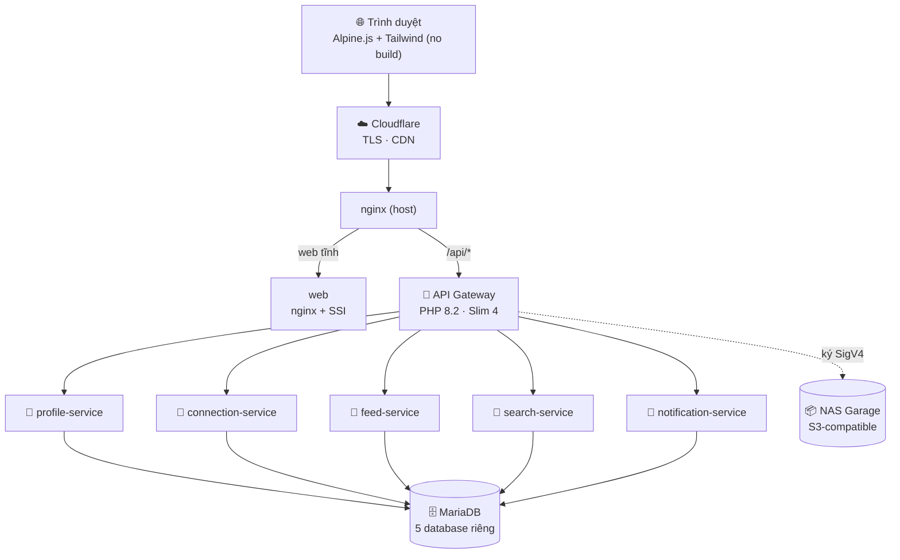

# ProConnect — Mạng xã hội nghề nghiệp (Microservices + API Gateway)

Đồ án môn **INT1448 — Phát triển phần mềm hướng dịch vụ** (PTIT). Trọng tâm: showcase **kiến trúc Microservices** với **API Gateway pattern**.

**ProConnect** là một mạng xã hội nghề nghiệp kiểu LinkedIn (hồ sơ, kết nối, news feed, tìm kiếm, thông báo) — nhưng thương hiệu & thiết kế riêng. Sản phẩm **chạy thật, deploy tự động**.

> 🌐 **Live:** https://soa.duyet.vn &nbsp;·&nbsp; ⚙️ **8 container** (5 microservice + Gateway + web + MariaDB) trong **2 GB RAM**

> 📌 Repo này nâng cấp từ một "SOA Blog" 3-service đời đầu của nhóm lên hệ ProConnect 5-service phong phú hơn (giữ tên repo `soa-blog`).

---

## Mục lục
- [Tổng quan kiến trúc](#tổng-quan-kiến-trúc)
- [API Gateway làm gì](#api-gateway-làm-gì)
- [Database-per-service](#database-per-service)
- [Tính năng](#tính-năng)
- [Công nghệ](#công-nghệ)
- [Cấu trúc thư mục](#cấu-trúc-thư-mục)
- [Bảng định tuyến API](#bảng-định-tuyến-api)
- [Chạy local](#chạy-local)
- [Triển khai (CI/CD)](#triển-khai-cicd)
- [Bảo mật](#bảo-mật)
- [Hạn chế & hướng phát triển](#hạn-chế--hướng-phát-triển)
- [Thành viên](#thành-viên)

---

## Tổng quan kiến trúc

Trình duyệt **chỉ nói chuyện với API Gateway** (điểm vào duy nhất `/api/*`). Năm dịch vụ phía sau **không lộ ra Internet** — chỉ gọi được trong mạng nội bộ Docker. Mỗi dịch vụ sở hữu **một database riêng**.



| Thành phần | Vai trò |
|---|---|
| **API Gateway** | Điểm vào duy nhất. Định tuyến, xác thực JWT, gộp dữ liệu, ràng buộc cross-service. **Không có DB.** |
| **profile-service** | Tài khoản, hồ sơ, kinh nghiệm, học vấn, kỹ năng, đăng nhập (bcrypt). |
| **connection-service** | Kết nối/social graph, lời mời, gợi ý. |
| **feed-service** | Bài viết, cảm xúc, bình luận, chia sẻ lại. |
| **search-service** | Tìm người theo tên/chức danh/kỹ năng. |
| **notification-service** | Thông báo lời mời/cảm xúc/bình luận. |
| **web** | Frontend tĩnh (nginx phục vụ + ghép partial bằng SSI). |
| **mariadb** | 1 container chứa 5 database tách biệt. |

---

## API Gateway làm gì

Gateway là **trọng tâm** của đồ án — nó không chứa nghiệp vụ, mà là "người gác cổng & điều phối":

| # | Trách nhiệm | Minh hoạ |
|---|---|---|
| 1 | **Định tuyến (Routing)** | Mọi `/api/*` vào Gateway rồi chuyển đúng dịch vụ; client không cần biết có bao nhiêu service. |
| 2 | **Xác thực JWT tập trung** | Chỉ Gateway giữ `JWT_SECRET`, ký + kiểm token (HS256), rồi chuyển danh tính xuống service qua header `X-User-Id`. |
| 3 | **API Composition** ⭐ | `GET /api/feed` gọi **3 dịch vụ** (connection → feed → profile) rồi gộp thành 1 JSON. `GET /api/profiles/{id}/full` gọi **2 dịch vụ song song**. Gọi theo lô `?ids=` để tránh N+1. |
| 4 | **Ràng buộc xuyên dịch vụ** | Thay khoá ngoại: mời người không tồn tại → 404; đã kết nối/đã gửi → 409. |
| 5 | **Gateway Offloading** | Rate-limit, request-id, CORS, ghi log gom hết về Gateway. |
| 6 | **Chịu lỗi cục bộ** | Mỗi lời gọi có timeout; phần phụ lỗi → trả dữ liệu chính kèm `meta.degraded`, không sập cả trang. |

Ngoài ra Gateway còn: **tải ảnh lên NAS** (ký SigV4, kiểm magic-byte ≤5MB) và **điều phối thông báo** best-effort sau mỗi react/comment.

---

## Database-per-service

Mỗi dịch vụ sở hữu **database riêng + DB user riêng** (chỉ truy cập schema của mình). **Không** có khoá ngoại vật lý xuyên database — mọi liên kết (vd "bài của user X") là liên kết *logic* do Gateway ghép qua API Composition.

| Service | Database | Bảng chính |
|---|---|---|
| profile | `proconnect_profile` | users, experience, education, skills |
| connection | `proconnect_connection` | connections (user_a, user_b, status) |
| feed | `proconnect_feed` | posts, comments, reactions |
| search | `proconnect_search` | chỉ mục tìm kiếm |
| notification | `proconnect_notification` | notifications |

> Cô lập ở mức **logic** (5 DB + 5 user trong 1 container MariaDB) — đủ cho phạm vi đề tài & 2 GB RAM; tách máy chủ vật lý là bước mở rộng.
>
> `posts` dùng cột `post_id` **Snowflake** làm định danh công khai (serialize dạng chuỗi để JS không mất chính xác), `id` auto-increment chỉ dùng nội bộ.

---

## Tính năng

- **Hồ sơ nghề nghiệp**: ảnh đại diện/bìa, chức danh, kinh nghiệm, học vấn, kỹ năng; gợi ý chức danh; tải ảnh trực tiếp; đổi avatar inline.
- **Kết nối**: gửi/chấp nhận/từ chối lời mời, gợi ý, trạng thái quan hệ trên hồ sơ.
- **News Feed**: soạn thảo trực quan WYSIWYG (Trix, HTML làm sạch phía server), nhiều ảnh + lightbox tương tác (react/comment ngay trong lightbox), cảm xúc nhiều loại (kiểu Facebook), bình luận, chia sẻ lại, sửa/xoá, permalink từng bài.
- **Tìm kiếm**: tìm người theo tên/chức danh/kỹ năng + nút kết nối nhanh.
- **Thông báo**: gần thời gian thực (polling), nhãn số chưa đọc, bấm vào nhảy đúng bài.

---

## Công nghệ

| Lớp | Công nghệ |
|---|---|
| Gateway & dịch vụ | PHP 8.2, Slim 4 (PSR-7), PHP-DI (Gateway), Guzzle (HTTP nội bộ) |
| Xác thực | firebase/php-jwt (HS256), bcrypt |
| Database | MariaDB 10.11, raw PDO (prepared statements) |
| Làm sạch nội dung | ezyang/HTMLPurifier (sanitize HTML phía server) |
| Frontend | HTML + Alpine.js + Tailwind (Play CDN, no build), Trix (WYSIWYG), nginx SSI |
| Lưu trữ ảnh | NAS Garage (S3-compatible), upload ký SigV4 |
| Hạ tầng | Docker Compose, nginx + php-fpm (supervisord), Cloudflare (TLS/CDN) |
| CI/CD | GitHub Actions → SSH deploy lên VPS |

---

## Cấu trúc thư mục

```
.
├── gateway/                  # API Gateway (Slim + PHP-DI) — không có DB
│   └── src/
│       ├── Controllers/      # Auth, Aggregate, Feed, Profiles, Connections, Search, Notifications, Media
│       ├── Services/         # *Client.php (Guzzle, ?ids= batch, async), S3Uploader (SigV4)
│       ├── Middleware/       # JwtAuth, OptionalJwt, RateLimit, RequestId, Cors
│       └── routes.php
├── services/
│   ├── profile-service/      # mỗi service: public/index.php, src/Controllers, src/Db.php (PDO)
│   ├── connection-service/
│   ├── feed-service/         # posts/comments/reactions + Snowflake.php + HTMLPurifier
│   ├── search-service/
│   └── notification-service/
├── web/                      # frontend tĩnh
│   ├── *.html                # mỗi trang 1 file; logic chung ở assets/app.js
│   ├── assets/app.js         # auth, api, postCardMixin, render, navbar
│   └── partials/             # post-card / lightbox / reactors — ghép bằng nginx SSI
├── db/                       # schema + migration (chạy theo thứ tự) + seed
├── scripts/deploy.sh         # pull → migrate → build → up → health-check
├── docker-compose.yml        # 8 service
└── .github/workflows/deploy.yml
```

---

## Bảng định tuyến API

Tất cả vào qua `/api/*` tại Gateway. 🔒 = cần JWT, 🌐 = công khai/optional-auth.

| Method | Endpoint | Auth | Dịch vụ |
|---|---|---|---|
| POST | `/api/auth/register` · `/api/auth/login` | 🌐 | profile (+ Gateway ký JWT) |
| GET | `/api/me` | 🔒 | profile |
| GET | `/api/profiles/{id}/full` ⭐ | 🌐 | **composition**: profile + connection |
| GET | `/api/profiles/{id}/posts` | 🌐 | **composition**: feed + profile |
| GET / PATCH | `/api/profiles/{id}` · `/api/profiles/me` | 🌐/🔒 | profile |
| POST/PATCH/DELETE | `/api/profiles/me/{experience\|education\|skills}` | 🔒 | profile |
| GET | `/api/connections` · `/requests` · `/suggestions` | 🔒 | connection |
| POST/DELETE | `/api/connections/requests…` (accept/reject/cancel) | 🔒 | connection (+ invariant 404/409) |
| GET | `/api/feed` ⭐ | 🔒 | **composition**: connection + feed + profile |
| POST | `/api/posts` | 🔒 | feed (sanitize HTML) |
| PATCH/DELETE/GET | `/api/posts/{id}` | 🔒/🌐 | feed |
| POST/DELETE/GET | `/api/posts/{id}/reactions` | 🔒 | feed |
| GET/POST | `/api/posts/{id}/comments` | 🌐/🔒 | feed |
| POST | `/api/posts/{id}/repost` · `/api/uploads` | 🔒 | feed · Gateway→S3 (SigV4) |
| GET | `/api/search?q=` | 🔒 | search |
| GET/POST | `/api/notifications` · `/read` · `/read-all` | 🔒 | notification |

---

## Chạy local

Yêu cầu: **Docker + Docker Compose**. Không cần PHP/Node trên máy.

```bash
cp .env.example .env          # điền JWT_SECRET (≥16 ký tự) + mật khẩu DB + S3 (nếu dùng upload)
docker compose build
docker compose up -d
# Gateway: http://127.0.0.1:8000   ·   Web: http://127.0.0.1:8080
curl http://127.0.0.1:8000/api/health
```

Schema + dữ liệu mẫu nạp tự động khi volume MariaDB còn trống (`db/*.sql` theo thứ tự alphabet).

---

## Triển khai (CI/CD)

Push lên nhánh `main` → **GitHub Actions** tự động:

```
1. Lint PHP   : php -l toàn bộ *.php (chặn lỗi cú pháp)
2. SSH deploy : ssh vào VPS → scripts/deploy.sh:
      git pull --ff-only → áp migration DB (idempotent, theo thứ tự)
      → docker compose build (chỉ khi đụng service/gateway)
      → docker compose up -d → health-check
```

- Thay đổi **chỉ web/** → bỏ qua build image (restart container web), deploy < 1 phút.
- Khoá SSH deploy lưu trong **GitHub Secrets** (`VPS_SSH_KEY`, `VPS_HOST`…), không nằm trong code.
- Website đứng sau **Cloudflare** (HTTPS Full-strict, chỉ nhận traffic từ Cloudflare).

---

## Bảo mật

- **Xác thực JWT (HS256)** chỉ tại Gateway; dịch vụ nội bộ không lộ cổng, chỉ tin `X-User-Id` trong mạng riêng.
- **Mật khẩu** băm bằng **bcrypt** (`password_hash`/`password_verify`).
- **Chống IDOR**: chỉ thao tác (sửa/xoá) dữ liệu của chính mình.
- **Chống XSS**: nội dung bài viết làm sạch bằng **HTMLPurifier** ở server (sanitize-on-write), allowlist thẻ hẹp + chỉ thuộc tính CSS `color`.
- **Chống SQL injection**: 100% prepared statements (PDO `EMULATE_PREPARES=false`).
- **Upload ảnh**: kiểm magic-byte thật + giới hạn 5MB; khoá S3 chỉ ở server (ký SigV4), trình duyệt không thấy.
- **Rate-limit** per-IP tại Gateway.

---

## Hạn chế & hướng phát triển

- **Ghép nối đồng bộ** (HTTP, chưa message queue) → chỉ mục tìm kiếm nhất quán cuối; composition khó mở rộng khi fan-out rất lớn.
- **Chịu lỗi tối giản**: mới có timeout + degrade, chưa có circuit breaker / retry / cache.
- **JWT 24h, stateless, chưa có refresh token** → token hết hạn thì đăng nhập lại; chưa thu hồi được trước hạn.
- **Database cô lập logic** (chung 1 container), chưa tách vật lý.
- **Mô hình tin `X-User-Id`** dựa vào cô lập mạng, chưa phải zero-trust.

---

## Thành viên

| Họ và tên | Phần việc chính | % |
|---|---|---|
| **Nguyễn Thế Duyệt** | API Gateway & nền tảng (định tuyến, JWT, rate-limit); API composition; upload ảnh S3 (SigV4); CI/CD & deploy; tích hợp tổng thể. | 50% |
| **Đinh Ngọc Long** | Tính năng nghiệp vụ: Hồ sơ, Kết nối (social graph), News Feed (rich-text + nhiều ảnh); giao diện feed ba cột. | 30% |
| **Vũ Duy Điệp** | Dịch vụ Tìm kiếm & Thông báo; seed dữ liệu mẫu; tinh chỉnh giao diện; kiểm thử nhanh. | 20% |

---

<sub>Đồ án học thuật — dữ liệu trên live demo là dữ liệu mẫu. Không sao chép thương hiệu/asset của LinkedIn.</sub>
